# 💧 Aqua Monitor — Water Quality Monitoring System
## User Guide

**Our Lady of Fatima University – Antipolo Campus**
Engineering Department | Water Quality Monitoring System (WQMS)

---

> **Who is this guide for?**
> This guide is written for **all users** of the Aqua Monitor system — whether you are a facility operator checking water quality daily, or an administrator managing the entire system. No technical background is required to follow this guide.

---

## 📋 Table of Contents

1. [What Is Aqua Monitor?](#1-what-is-aqua-monitor)
2. [How the System Works (Simple Overview)](#2-how-the-system-works-simple-overview)
3. [Understanding User Roles](#3-understanding-user-roles)
4. [Public Information Website](#4-public-information-website)
5. [Logging In to the System](#5-logging-in-to-the-system)
6. [Operator Portal Guide](#6-operator-portal-guide)
   - [Operator Dashboard](#61-operator-dashboard)
   - [Live Water Monitoring](#62-live-water-monitoring)
   - [Fountain Status & Filter Health](#63-fountain-status--filter-health)
   - [Water Quality Reports](#64-water-quality-reports)
   - [Account Settings](#65-account-settings)
   - [Help & Support](#66-help--support)
7. [Administrator Portal Guide](#7-administrator-portal-guide)
   - [Admin Dashboard](#71-admin-dashboard)
   - [Fountain Management](#72-fountain-management)
   - [Sensor Management & Thresholds](#73-sensor-management--thresholds)
   - [Alerts & Notifications](#74-alerts--notifications)
   - [Reports & Compliance](#75-reports--compliance)
   - [User Management](#76-user-management)
   - [System Settings](#77-system-settings)
8. [Understanding Water Quality Readings](#8-understanding-water-quality-readings)
9. [Alert Colors & Status Indicators](#9-alert-colors--status-indicators)
10. [Starting and Stopping the System](#10-starting-and-stopping-the-system)
11. [Frequently Asked Questions (FAQ)](#11-frequently-asked-questions-faq)
12. [Troubleshooting Common Problems](#12-troubleshooting-common-problems)

---

## 1. What Is Aqua Monitor?

**Aqua Monitor** is a smart water quality monitoring system built for the drinking fountains at **Our Lady of Fatima University (OLFU) – Antipolo Campus**. It was developed as a capstone project to help ensure that every drinking fountain on campus provides safe, clean water at all times.

### What does it do?

- 🔵 **Monitors water quality automatically** — Small electronic sensors are installed at each drinking fountain. These sensors continuously check the water and send measurements to the system every second.
- 🔔 **Sends alerts when water is unsafe** — If the system detects that water quality is outside safe limits, it automatically sends a notification via SMS or email to the responsible staff.
- 📊 **Shows real-time data on a web dashboard** — Authorized staff can view the current water quality of all campus fountains from any computer or device with a web browser.
- 📄 **Keeps historical records** — All readings are saved so that reports can be generated for compliance, review, or maintenance planning.

### Why is this important?

Drinking water that looks clean may still contain harmful levels of minerals, bacteria-promoting temperature, or invisible contamination. The Aqua Monitor system continuously checks water so that problems are caught immediately — before anyone's health is affected.

---

## 2. How the System Works (Simple Overview)

You do not need to understand the technology to use this system. Here is a simple, plain-language explanation of how it works:

```
[ Water Fountain ]
       ↓
 Sensors measure the water
 (pH, Cloudiness, Dissolved Solids, Temperature)
       ↓
 Data is sent to the system over the internet
       ↓
 The system checks: Is the water safe?
       ↓
 ┌─────────────────────┬───────────────────────┐
 │    YES → Safe       │   NO → Problem found  │
 │    Dashboard shows  │   Alert is sent via   │
 │    green / normal   │   SMS/email to staff  │
 └─────────────────────┴───────────────────────┘
       ↓
 Staff views data on the web dashboard
 and takes action if needed
```

**In simple terms:** Sensors check the water → The system reviews the data → Staff is notified if anything is wrong → Staff takes action.

---

## 3. Understanding User Roles

The Aqua Monitor system has **two types of accounts**, each with a different level of access:

### 👤 Operator (Standard User)
This account is for **facility staff, maintenance personnel, and lab technicians** who need to monitor water quality on a day-to-day basis.

**An Operator can:**
- ✅ View live water quality readings and charts
- ✅ Check the status of all campus fountains
- ✅ View and download water quality reports
- ✅ Log maintenance issues
- ✅ Update their own profile and password

**An Operator cannot:**
- ❌ Add, remove, or edit fountain records
- ❌ Change alert threshold limits
- ❌ Manage other users' accounts
- ❌ Configure system settings

---

### 🔐 Administrator (Admin)
This account is for **department heads, lead engineers, and system administrators** who oversee the entire monitoring system.

**An Administrator can do everything an Operator can, plus:**
- ✅ Add, edit, or remove drinking fountains from the system
- ✅ Configure sensor settings and safety threshold limits
- ✅ Fully manage and resolve system alerts
- ✅ Create, edit, or disable user accounts
- ✅ Configure SMS/email notification settings
- ✅ Access system-wide compliance reports and audit logs

---

### At-a-Glance Role Comparison

| Feature | Operator | Administrator |
|:--------|:--------:|:-------------:|
| View live water readings | ✅ | ✅ |
| View fountain locations & status | ✅ | ✅ |
| Download reports (CSV/PDF) | ✅ | ✅ |
| Update personal profile & password | ✅ | ✅ |
| Log maintenance issues | ✅ | ✅ |
| Add / remove fountains | ❌ | ✅ |
| Set safety threshold limits | ❌ | ✅ |
| Manage & resolve alerts | View only | ✅ Full access |
| Manage user accounts | ❌ | ✅ |
| Configure SMS/email alerts | ❌ | ✅ |

---

## 4. Public Information Website

The Aqua Monitor system includes a **public-facing website** that anyone on campus can visit — no login required. This website is for general information only.

### Pages Available to the Public

#### 🏠 Home Page
The main landing page of the Aqua Monitor website. It displays:
- A brief introduction to the water quality monitoring project
- Live summary readings (pH level, Turbidity, Temperature, TDS) from campus fountains
- Navigation links to other sections of the site

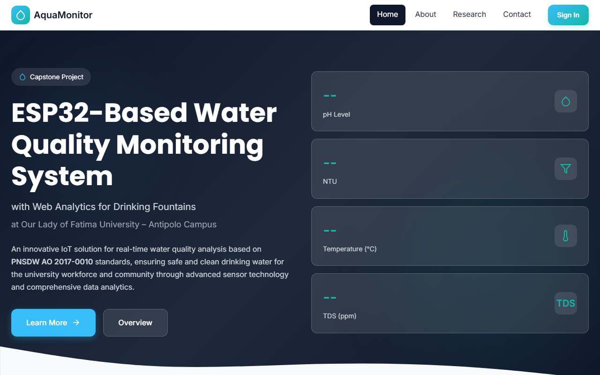

#### ℹ️ About Aqua Monitor
Provides background information on the project, including:
- The purpose and goals of the water monitoring system
- How the sensor technology works (explained in simple terms)
- The environmental and health standards the system follows

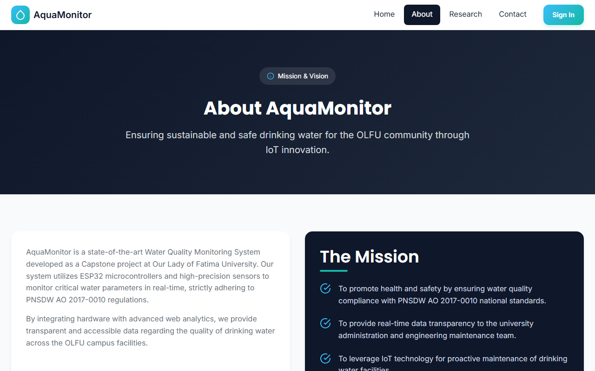

#### 📍 Campus Fountain Locator
An interactive list of all drinking fountains on campus. For each fountain, you can see:
- The fountain's name and building location
- Current operational status: **Online** (working normally), **Offline** (not responding), or **Under Maintenance**

This page helps students and faculty know which fountains are currently safe and available to use.

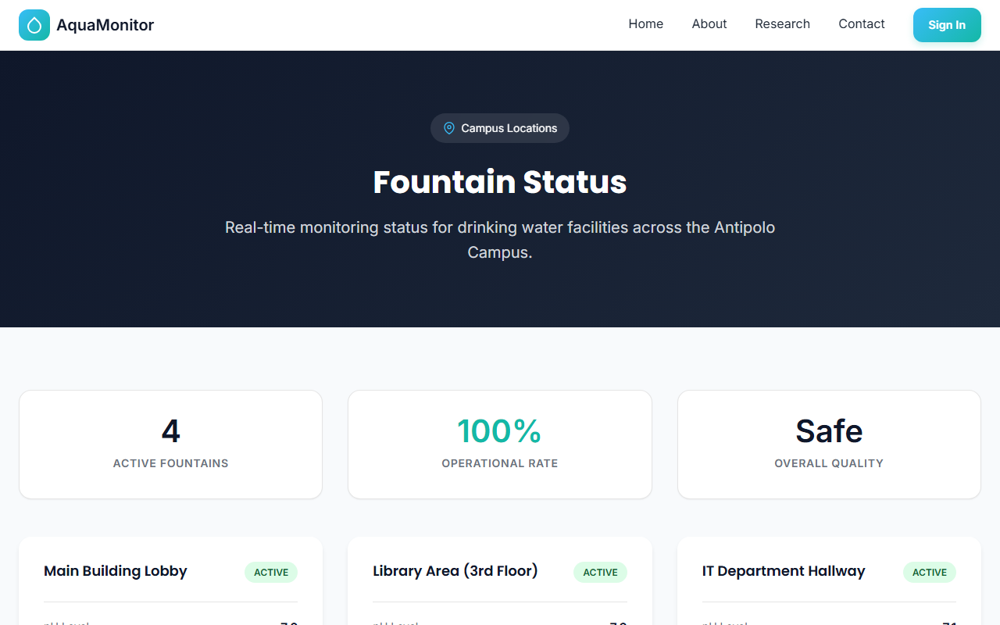

#### 🔬 Water Safety & Research
An educational reference page that explains what each water quality measurement means and why it matters to your health. This page references the standards set by the **Philippine National Standards for Drinking Water (PNSDW AO 2017-0010)** and the **World Health Organization (WHO)**.

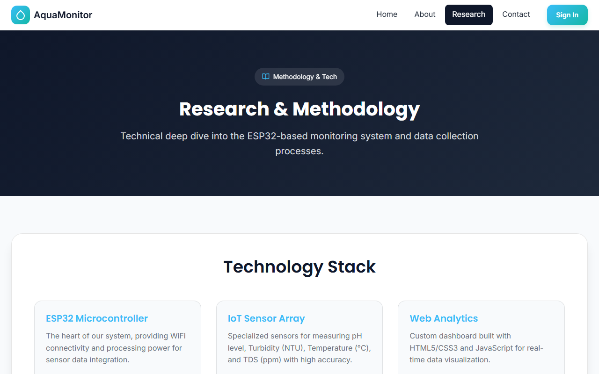

#### 📬 Contact & Support
A public contact form where students, faculty, or visitors can:
- Send feedback about a fountain
- Report a physical problem (e.g., a fountain is broken, has an unusual smell or color)
- Contact the facility management team directly

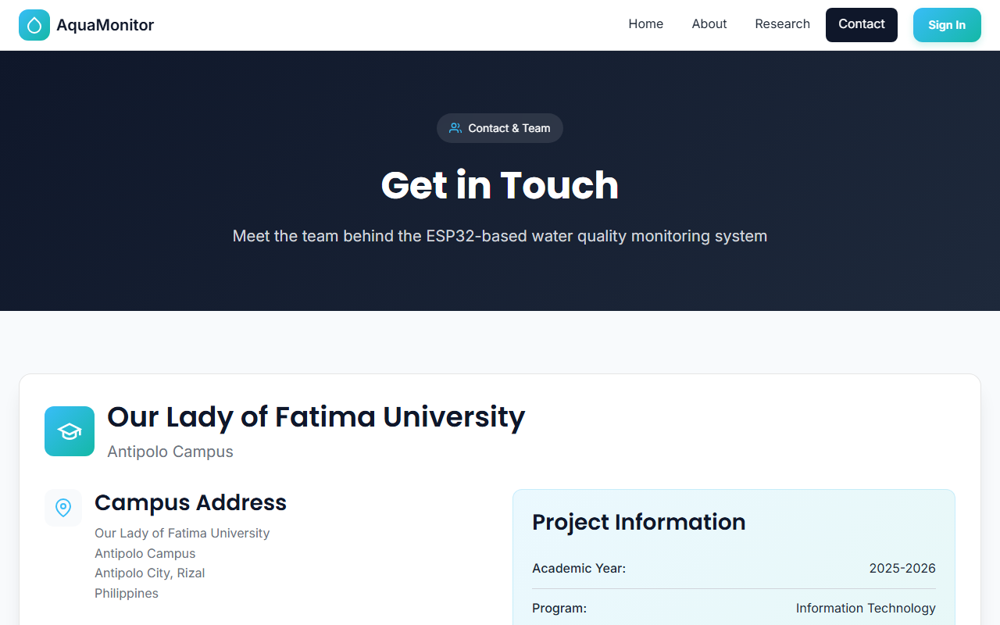

---

## 5. Logging In to the System

Only authorized staff members can log in to the monitoring portals (Operator or Admin). There are two separate login pages.

### How to Log In as an Operator

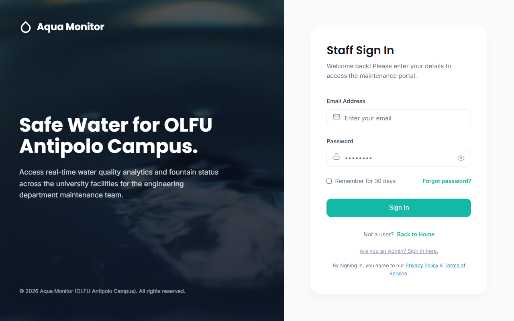

1. Open your web browser (e.g., Google Chrome, Microsoft Edge)
2. Go to the login page address provided by your system administrator
3. Enter your **email address** and **password**
4. Click the **"Sign In"** button
5. You will be taken directly to the **Operator Dashboard**

> **Tip:** If you forget your password, click the **"Forgot password?"** link on the login page, or contact your system administrator.

---

### How to Log In as an Administrator

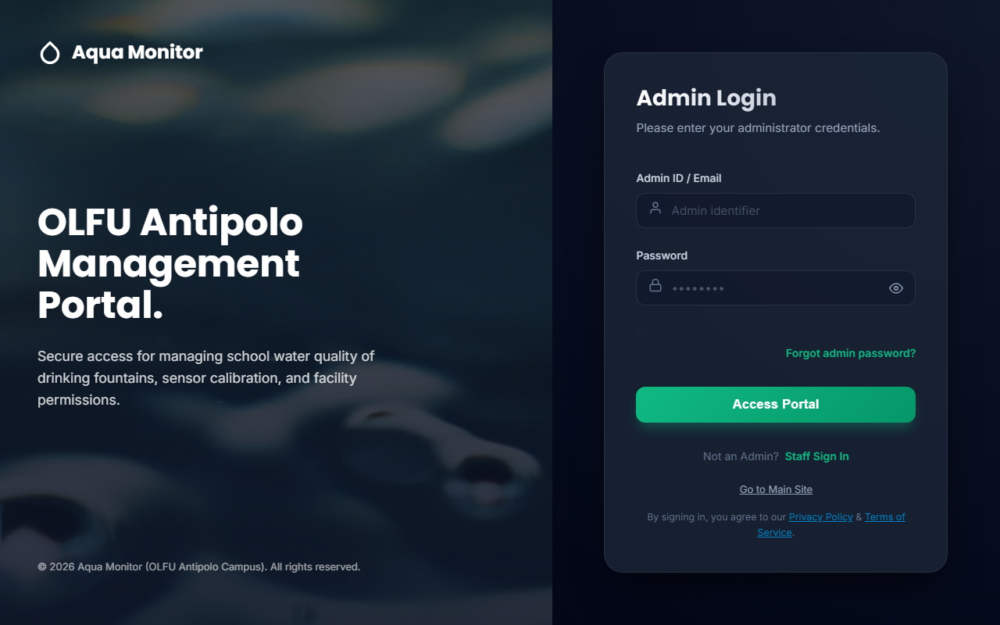

1. Open your web browser
2. Go to the **Admin login page** address (separate from the Operator login — your administrator will provide this link)
3. Enter your **admin email address** and **password**
4. Click **"Sign In"**
5. You will be taken to the **Admin Dashboard**

> **Note:** The Admin login page is a separate, secured page to prevent unauthorized access.

---

### Logging Out

To log out of your account:
- Click your **profile icon** or name in the sidebar
- Select **"Log Out"** from the menu

> **Important:** Always log out when you are done, especially on shared computers, to protect the system from unauthorized access.

---

## 6. Operator Portal Guide

The **Operator Portal** is the daily-use interface for facility operators and maintenance staff. After logging in, you will see a navigation sidebar on the left side of the screen with links to all available pages.

---

### 6.1 Operator Dashboard

**What is it?**
The Dashboard is the first page you see after logging in. It gives you a quick summary of the current water quality across campus fountains.

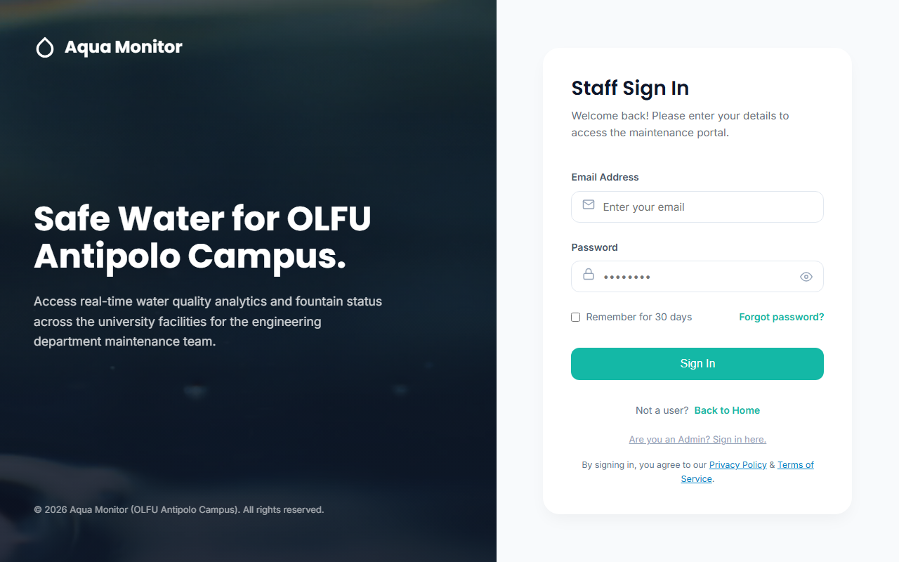

**What you will see on this page:**

#### 📊 Four Water Quality Cards
At the top of the page, there are four colored cards displaying the current readings:

| Card | What It Measures | Safe Range |
|:-----|:-----------------|:-----------|
| **pH Level** | How acidic or alkaline the water is | 6.5 – 8.5 |
| **Turbidity** | How clear or cloudy the water is | Below 5 NTU |
| **Temperature** | Water temperature | 15°C – 30°C |
| **TDS** | Total amount of dissolved materials in water | Below 500 ppm |

Each card also shows a **status badge** (e.g., "Safe", "Excellent", "Optimal", "Pure") so you can quickly see if the water is within acceptable limits.

#### 📈 Trend Charts
Below the cards, four charts show how each measurement has been changing over time. These charts update automatically as new sensor data comes in.

#### 💡 Weekly Trend Insights
Three summary boxes give you an at-a-glance analysis:
- **Water Quality** — Overall rating of the water quality
- **Purity Level** — Assessment based on TDS and Turbidity combined
- **Health Impact** — Whether the current mineral balance is healthy

#### 📋 Water Quality Standards Reference
A reference table at the bottom shows the safe ranges for each parameter according to the official **PNSDW AO 2017-0010** standard.

**How to switch between fountains:**
Click the **"Switch Fountain"** button at the top right of the page to cycle through different fountain locations and see their individual readings.

---

### 6.2 Live Water Monitoring

**What is it?**
The Live Monitoring page shows you detailed, real-time charts and data for all campus fountains. This is where you go if you want to look more closely at water quality trends.

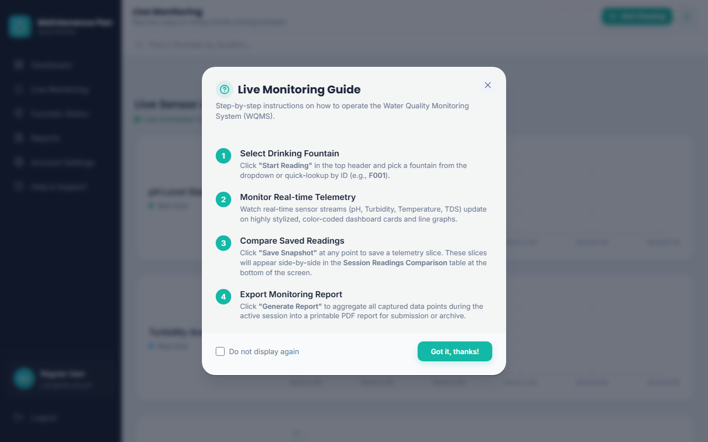

**What you will see:**

- **Live Charts** — Continuously updating graphs for each water quality parameter. The charts scroll as new data arrives, so you are always looking at the most current information.
- **Fountain Selector** — A dropdown or filter that lets you choose which fountain to focus on.
- **Comparison Table** — A side-by-side table comparing readings from multiple fountains at once.
- **Export / Print Options** — You can download or print a snapshot of the current monitoring data as a PDF report directly from this page.

> **Note:** This page requires an active connection to the system. If charts appear empty or show "No data," the sensor at that fountain may be offline. Contact your administrator.

---

### 6.3 Fountain Status & Filter Health

**What is it?**
This page shows you the current **operational status** of every drinking fountain on campus, along with information about the water filter's health.

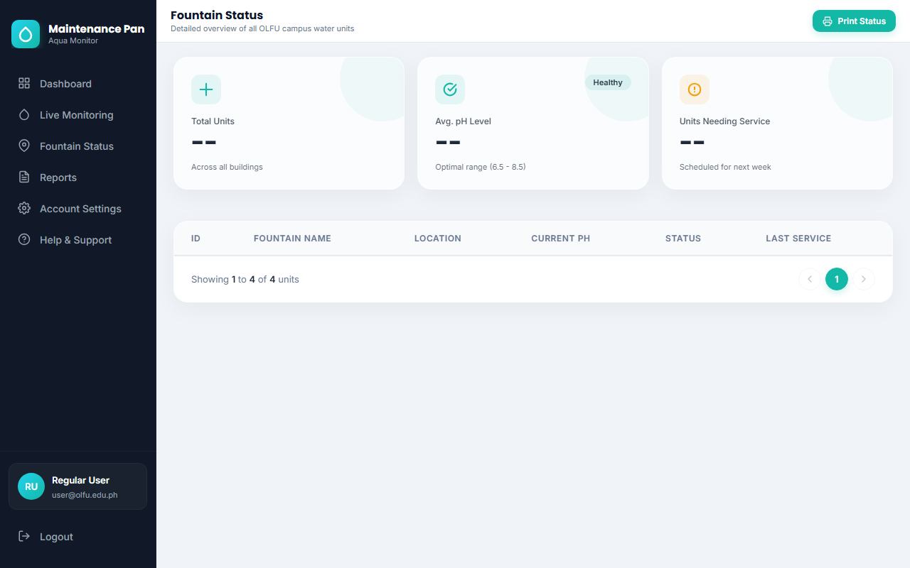

**What you will see:**

#### Fountain Status Cards
Each fountain on campus is shown as a card with:
- The fountain's **name** and **location** (e.g., "SPCB Building – Near Main Entrance")
- Current **status** indicator:
  - 🟢 **Online** — Working normally, water is safe
  - 🟡 **Warning** — One or more readings are approaching unsafe levels
  - 🔴 **Offline** — The fountain is not responding or is under maintenance
- Latest water quality readings for that fountain
- **Filter life percentage** — A visual progress bar showing how much useful life the water filter has remaining

> **What to do if a fountain shows Warning or Offline?**
> Note the fountain's name and location, and report it to your supervisor or log a maintenance request through the Help page. Administrators will be able to take further action.

---

### 6.4 Water Quality Reports

**What is it?**
The Reports page allows you to view and download historical water quality records for any date range you choose.

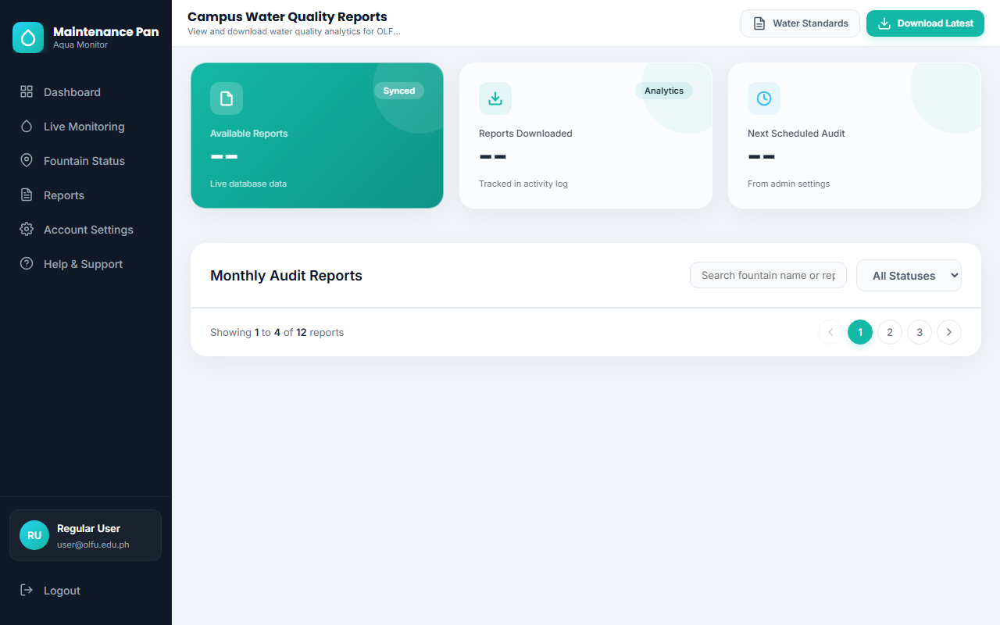

**How to generate a report:**

1. **Select a start date** — Click the start date field and choose the beginning of the period you want to review
2. **Select an end date** — Choose the end of the period
3. **Choose a fountain** (optional) — Filter the report to a specific fountain, or view all fountains
4. Click the **"Generate Report"** button
5. The report table will appear below, showing all recorded readings for the selected period

**How to download a report:**

- Click **"Download CSV"** to save the data as a spreadsheet (can be opened in Microsoft Excel or Google Sheets)
- Click **"Download PDF"** to save the data as a printable document

**What the report includes:**
- Date and time of each reading
- Fountain name and location
- pH level, Turbidity, Temperature, and TDS readings
- Safety status at the time of each reading (Safe / Warning / Critical)

---

### 6.5 Account Settings

**What is it?**
The Account Settings page allows you to manage your personal profile and update your login password.


**What you can do here:**

#### Update Your Profile
- Change your **display name**
- Update your **contact number** (used for SMS alert subscriptions)
- Upload or change your **profile photo**

#### Change Your Password
1. Click on the **"Security"** tab in the settings page
2. Enter your **current password**
3. Enter a **new password**
4. Enter the new password again to **confirm** it
5. Click **"Save Changes"**

> **Password tip:** Choose a password that is at least 8 characters long and includes a mix of letters and numbers. Avoid using your name or simple sequences like "12345678".

---

### 6.6 Help & Support

**What is it?**
The Help & Support page provides self-service guidance and a way to report physical fountain issues.

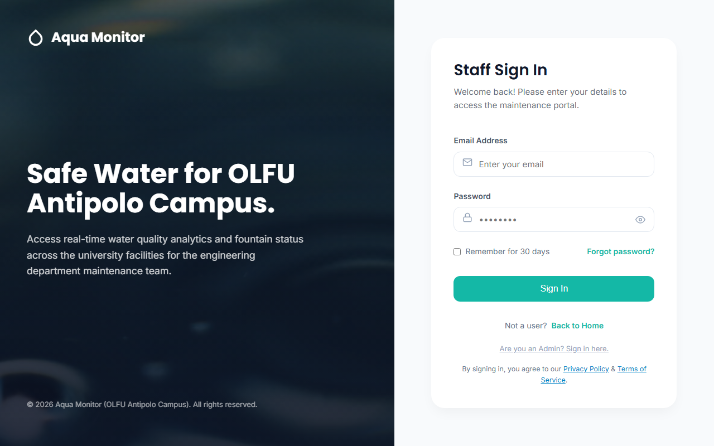

**What you will find here:**

- **Quick Reference Guide** — A summary of what each button and section in the Operator Portal does
- **Common Error Messages** — Explanations of any messages you might see in the system and what to do about them
- **Maintenance Request Form** — A form you can fill out to report a physical problem with a fountain (e.g., it is leaking, the button is broken, there is an unusual smell). Your request will be sent to the engineering team.

---

## 7. Administrator Portal Guide

The **Administrator Portal** gives full control over the Aqua Monitor system. It includes everything in the Operator Portal, plus tools for managing fountains, sensors, users, and system settings.

After logging in as an Administrator, you will see the Admin sidebar with all available management pages.

---

### 7.1 Admin Dashboard

**What is it?**
The Admin Dashboard is a comprehensive overview of the entire water monitoring system. It is designed for decision-makers who need a full picture of system health at a glance.

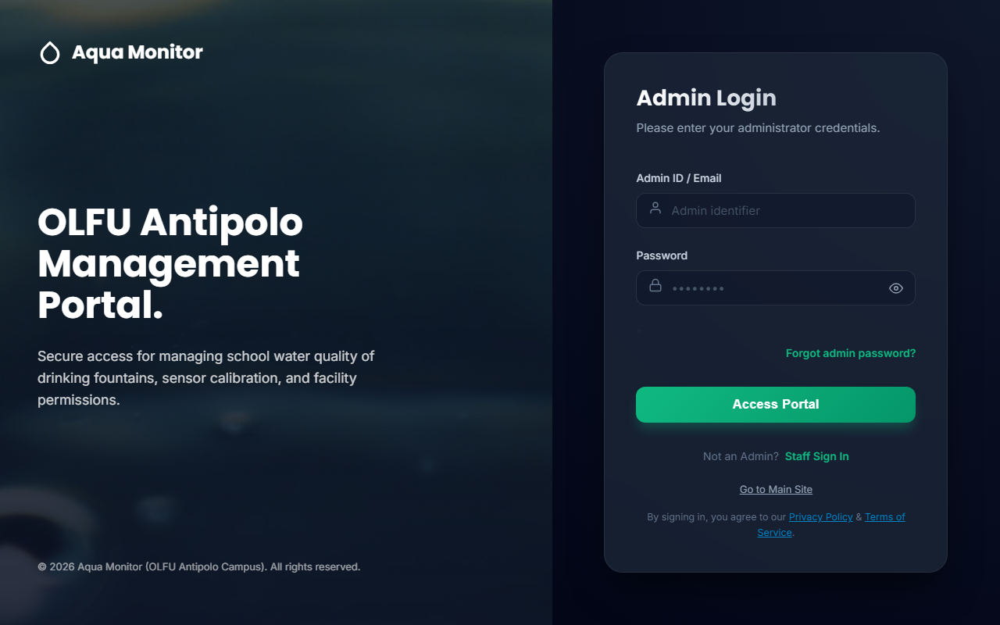

**What you will see:**

#### Water Quality Summary Cards
Four cards showing the current system-wide readings for pH, Turbidity, Temperature, and Total Dissolved Solids (TDS), with auto-refresh toggles for each card.

#### Live Charts
Multiple interactive charts:
- **pH Level Trend** — How pH has changed over time
- **Turbidity Levels** — Cloudiness trend
- **Temperature Monitoring** — Water temperature over time
- **TDS Levels Trend** — Dissolved solids over time
- **Multi-Parameter Overview** — All four parameters in one chart for easy comparison

Each chart has a **download button** so you can save the chart as an image.

#### Trend Analysis & System Health
Four summary indicators:
- **Stability Score** — An overall performance score for the monitoring system
- **pH Variance** — How much the pH level has been fluctuating
- **Anomaly Detection** — How many unusual or critical readings were detected
- **Peak Temperature** — The highest water temperature recorded

#### Footer Stats Bar
At the bottom of the dashboard, a quick-glance bar shows:
- **System Health** — Overall system performance status
- **Active Alerts** — Number of unresolved alerts
- **Compliance** — Whether the system is currently meeting PNSDW standards
- **Performance** — Real-time performance rating

---

### 7.2 Fountain Management

**What is it?**
The Fountain Management page is where Administrators add, edit, or remove drinking fountain records from the system.

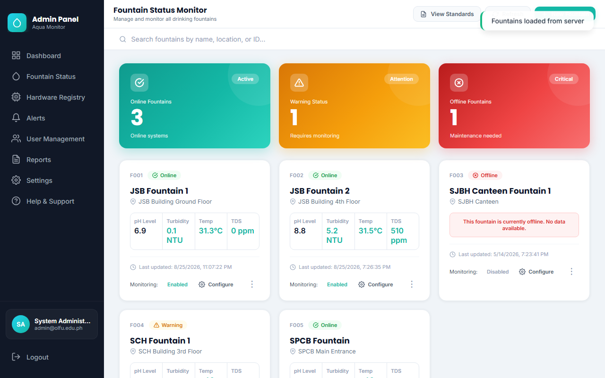

**How to add a new fountain:**

1. Click the **"New Fountain"** button at the top right of the page
2. A form will appear asking for:
   - **Fountain ID** — A unique code for the fountain (e.g., F001, F002)
   - **Fountain Name** — A descriptive name (e.g., "SPCB Building Fountain")
   - **Location Description** — Where the fountain is (e.g., "Near Main Entrance, Ground Floor")
   - **Initial Status** — Set to Online, Warning, or Offline
3. Click **"Save Fountain"** to add it to the system

**How to edit an existing fountain:**

1. Find the fountain you want to edit in the fountain list
2. Click the **edit button** (pencil icon) on that fountain's card
3. Make your changes in the form that appears
4. Click **"Save Fountain"** to apply the changes

**How to remove a fountain:**

1. Find the fountain in the list
2. Click the **delete button** (trash icon) on that fountain's card
3. Confirm the deletion when prompted

> **Important:** Deleting a fountain will remove all of its records from the system. This action cannot be undone. Only delete a fountain if it has been permanently removed from campus.

**Searching for a fountain:**
Use the **search bar** at the top of the page to find a fountain by name, location, or ID number.

**Fountain Status Summary:**
At the top of the page, three colored cards show a count of how many fountains are currently:
- 🟢 **Online** — Operating normally
- 🟡 **Warning** — Needs monitoring
- 🔴 **Offline** — Not responding / under maintenance

---

### 7.3 Sensor Management & Thresholds

**What is it?**
This page allows Administrators to view sensor information and configure the **safety threshold limits** — the values that determine when the system sends an alert.

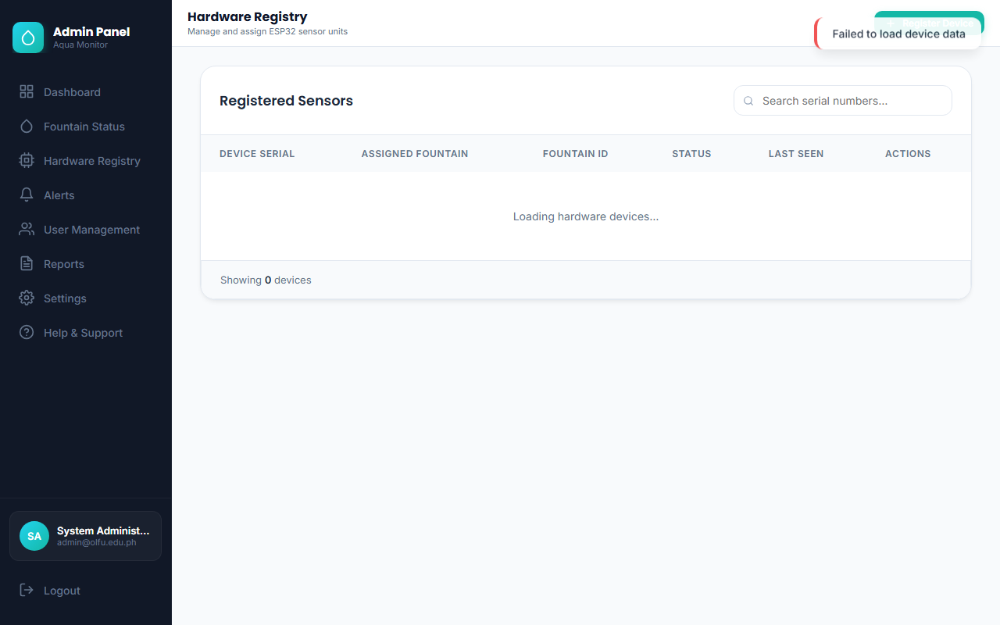

#### Understanding Thresholds
A **threshold** is a boundary value. When a water quality reading crosses a threshold, the system automatically flags it as a warning or critical alert.

For example: If the safe pH range is 6.5 to 8.5, then:
- A reading of **7.0** is safe — no alert
- A reading of **6.2** crosses the warning threshold — an alert is sent
- A reading of **5.8** crosses the critical threshold — an urgent alert is sent

**How to update a threshold:**

1. Navigate to **Sensor Management** in the admin sidebar
2. Find the parameter you want to update (pH, Turbidity, Temperature, or TDS)
3. Click the edit button next to that parameter's threshold settings
4. Enter the new **warning** and **critical** threshold values
5. Click **"Save"** to apply the changes

> **Caution:** Only adjust thresholds if you are sure of the correct safe limits. Incorrect thresholds can cause missed alerts (too lenient) or excessive false alarms (too strict). Refer to the **PNSDW AO 2017-0010** standards when setting limits.

---

### 7.4 Alerts & Notifications

**What is it?**
The Alerts page shows a log of every time a water quality reading went outside the safe limits. It also allows Administrators to resolve alerts and send manual notifications.


**How to read the alert log:**

Each alert entry shows:
- The **date and time** the alert was triggered
- The **fountain location** where the problem was detected
- Which **parameter** triggered the alert (e.g., pH, Turbidity)
- The **reading value** that caused the alert
- The **severity level** — Warning or Critical
- The **current status** — Active (not yet resolved) or Resolved

**How to resolve an alert:**

1. Find the active alert in the list
2. Click the **"Resolve"** button next to it
3. The alert will be marked as resolved and logged with the current date and time

**How to send a manual SMS notification:**

1. On the Alerts page, click the **"Send SMS"** or manual notification button
2. Select the recipient (a registered staff member's phone number)
3. Write a short message describing the issue
4. Click **"Send"**

> **Note:** Manual SMS notifications require an active SMS service connection (configured under System Settings). If SMS sending fails, check the SMS gateway configuration.

---

### 7.5 Reports & Compliance

**What is it?**
The Admin Reports page gives Administrators access to more detailed reporting tools than the Operator Portal, including multi-building analysis and official compliance reports.

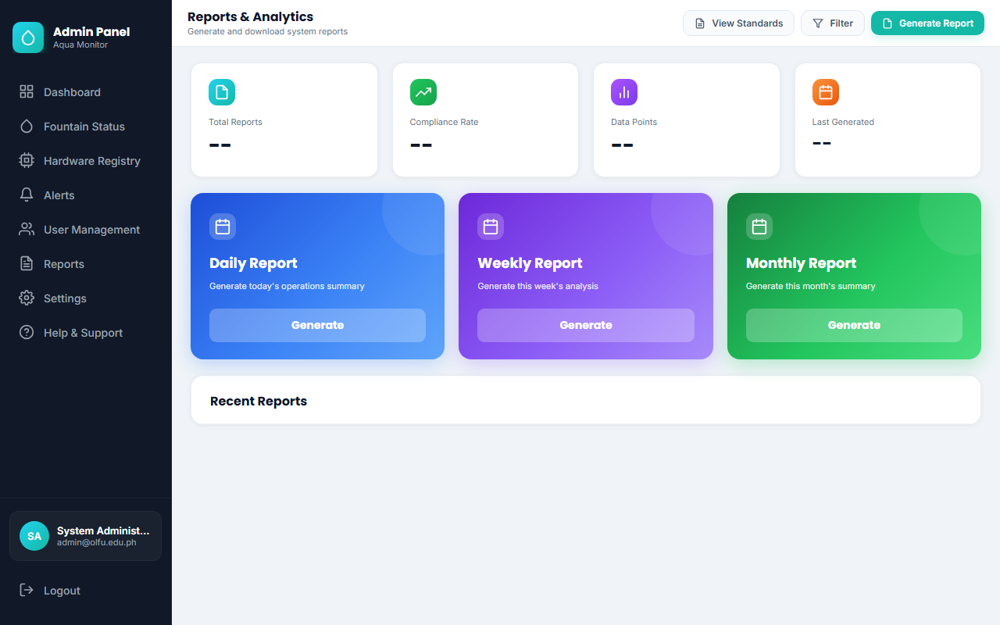

**Types of reports available:**

- **Water Quality Report** — Detailed log of all sensor readings for any date range and any fountain
- **Compliance Report** — A formatted report showing whether each fountain met the PNSDW standards during a selected period. This can be used for official institutional audits.
- **Trend Charts** — Visual graphs showing patterns over days, weeks, or months

**How to generate a report:**

1. Select the **report type** from the options at the top of the page
2. Set the **date range** (start date and end date)
3. Select a **fountain** or choose "All Fountains" for a system-wide report
4. Click **"Generate"**
5. The report will appear below the filters

**How to download a report:**

- Click **"Export CSV"** to download a spreadsheet version
- Click **"Export PDF"** to download a printable document version

---

### 7.6 User Management

**What is it?**
The User Management page allows Administrators to manage all accounts in the system — creating new users, changing their roles, or disabling accounts that are no longer needed.

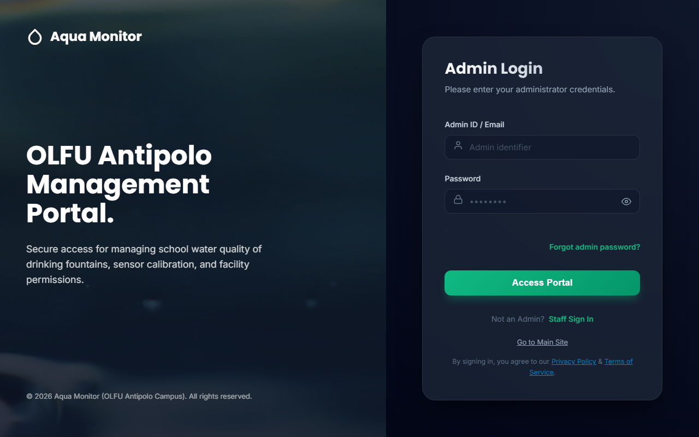

**What you will see:**

#### Role Summary Cards
Three cards at the top show a count of:
- 🟣 **Administrators** — Accounts with full access
- 🟦 **Standard Users** — Operator accounts with monitoring access
- 🟠 **Inactive Accounts** — Accounts that have been suspended or disabled

#### User List Table
A table showing all registered accounts with columns for:
- **User Name** — The person's name
- **Email** — Their login email address
- **Engineering Branch** — Their assigned department or branch
- **Role** — Administrator or Standard User
- **Status** — Active or Disabled
- **Last Active** — When they last logged into the system
- **Actions** — Buttons to edit or disable the account

**How to add a new user:**

1. Click the **"Add User"** button at the top right
2. Fill in the form:
   - Full name
   - Email address (this will be their login username)
   - Password (they can change it after first login)
   - Role (Operator or Administrator)
   - Engineering Branch / Department
3. Click **"Save"** to create the account

**How to edit an existing user:**

1. Find the user in the table
2. Click the **"Edit"** button in their row
3. Update the necessary fields
4. Click **"Save Changes"**

**How to disable a user account:**

1. Find the user in the table
2. Click the **"Disable"** button in their row
3. Confirm the action when prompted

> **Note:** Disabling an account prevents that person from logging in, but their data and history remain in the system. This is safer than permanently deleting an account.

**Searching for a user:**
Use the **search bar** at the top of the page to find a user by name or email address.

---

### 7.7 System Settings

**What is it?**
The System Settings page allows Administrators to configure system-wide settings, including security options and the notification service.


**Settings available:**

#### Profile Settings
Update the administrator's own display name, contact information, and profile photo.

#### Security Settings
- **Two-Factor Authentication (2FA)** — Turn on an extra security step that sends a one-time code to your registered phone number when you log in. This adds an additional layer of protection for admin accounts.
- **Session Timeout** — Set how long the system waits before automatically logging out an inactive user.

> **What is Two-Factor Authentication?**
> It is an extra security step that requires you to enter a code sent to your phone in addition to your password. Even if someone knows your password, they cannot log in without your phone. This is strongly recommended for all admin accounts.

**How to save changes:**
After making any changes on this page, click the **"Save Changes"** button at the top right of the page to apply them.

---

## 8. Understanding Water Quality Readings

The Aqua Monitor system measures four key water quality parameters. Here is what each one means in plain language and why it matters for drinking water safety.

---

### 💧 pH Level
**What it is:** A scale from 0 to 14 that measures how acidic or alkaline the water is. A pH of 7 is neutral (like pure water). Lower numbers are more acidic; higher numbers are more alkaline.

**Why it matters:**
- Water that is too acidic can corrode pipes and release harmful metals like lead into the water.
- Water that is too alkaline tastes bitter and can cause scale build-up in pipes.

**Safe range:** **6.5 – 8.5**

| Reading | Status |
|:--------|:-------|
| 6.5 – 8.5 | ✅ Safe |
| 6.0 – 6.4 or 8.6 – 9.0 | ⚠️ Warning — Monitor closely |
| Below 6.0 or above 9.0 | 🚨 Critical — Take immediate action |

---

### 🌊 Turbidity (Water Clarity)
**What it is:** A measure of how cloudy or murky the water appears. It is measured in **NTU** (Nephelometric Turbidity Units). Lower numbers mean the water is clearer.

**Why it matters:**
- High turbidity means there are tiny particles suspended in the water — this could be dirt, silt, rust, or signs that the water filter is failing.
- Cloudy water may contain bacteria or other contaminants.

**Safe range:** **Below 5 NTU** (ideally below 1 NTU)

| Reading | Status |
|:--------|:-------|
| Below 1.0 NTU | ✅ Excellent |
| 1.0 – 5.0 NTU | ⚠️ Warning — Check filter |
| Above 5.0 NTU | 🚨 Critical — Do not drink |

---

### 🌡️ Temperature
**What it is:** The actual temperature of the water in **degrees Celsius (°C)**.

**Why it matters:**
- Water that is too warm creates ideal conditions for bacteria to grow in the pipes and storage areas.
- Cool, safe water temperatures help ensure the water stays fresh and does not develop bacterial contamination.

**Safe range:** **15°C – 30°C**

| Reading | Status |
|:--------|:-------|
| 15°C – 25°C | ✅ Ideal |
| 25.1°C – 30°C | ⚠️ Warning — Monitor closely |
| Above 30°C | 🚨 Critical — Risk of bacterial growth |

---

### ⚗️ TDS — Total Dissolved Solids
**What it is:** A measure of how many minerals, salts, and other dissolved substances are in the water. It is measured in **ppm** (parts per million).

**Why it matters:**
- A small amount of dissolved minerals is normal and even beneficial (such as calcium and magnesium).
- Too many dissolved solids indicate water contamination, high salinity, or excessive mineral content — which can affect taste and health.

**Safe range:** **Below 300 ppm** (acceptable up to 500 ppm)

| Reading | Status |
|:--------|:-------|
| Below 300 ppm | ✅ Pure |
| 300 – 500 ppm | ⚠️ Warning — Elevated minerals |
| Above 500 ppm | 🚨 Critical — Likely contamination |

---

## 9. Alert Colors & Status Indicators

Throughout the Aqua Monitor system, color-coded labels and icons are used to quickly communicate the status of a fountain or a reading. Here is what each color means:

| Color | Status | What It Means |
|:------|:-------|:--------------|
| 🟢 **Green** | Online / Safe | Everything is working normally. Water quality is within safe limits. |
| 🟡 **Yellow / Orange** | Warning | A reading is approaching an unsafe level. Staff should check the fountain soon. |
| 🔴 **Red** | Critical / Offline | A serious problem was detected, or the fountain is not responding. Immediate action is needed. |
| ⚫ **Grey** | Unknown / No Data | The system is not receiving data from this fountain. It may be turned off or disconnected. |

---

## 10. Starting and Stopping the System

> **This section is only relevant if the system is hosted locally on a computer on campus.** If your system is hosted online (on a web server), it is always running and you do not need to manually start or stop it — simply open your browser and go to the system's web address.

### Starting the System (Local Installation)

1. Go to the **CAPSTONE-WQMS** folder on the computer where the system is installed
2. Find the file named **`start_wqms.bat`**
3. **Double-click** on this file to run it
4. A black command window will open and the system will start automatically. It will:
   - Start the database service
   - Start the web server
   - Automatically open your browser to the Aqua Monitor home page
5. Do **not** close the black command window — the system needs it to run

> **Wait a moment:** After double-clicking, it may take 5–10 seconds for the browser to open. This is normal.

### Stopping the System (Local Installation)

1. Go to the same **CAPSTONE-WQMS** folder
2. Find the file named **`stop_wqms.bat`**
3. **Double-click** on this file
4. The system will shut down and the command window will close

> **Always stop the system properly** using the `stop_wqms.bat` file instead of just closing the command window. Proper shutdown helps protect the database from data loss.

---

## 11. Frequently Asked Questions (FAQ)

**Q: What web browser should I use to access the system?**
Any modern web browser works, including Google Chrome, Microsoft Edge, Mozilla Firefox, or Safari. For the best experience, use the latest version of Google Chrome or Microsoft Edge.

---

**Q: I forgot my password. What do I do?**
On the login page, click **"Forgot password?"** If this option is not available, contact your system Administrator. They can reset your password from the User Management page.

---

**Q: The dashboard is not showing any data. Why?**
This usually means one of the following:
- The system server is not running (if locally hosted). Ask your administrator to start it.
- The sensor at that fountain is offline or disconnected.
- Your internet connection is interrupted.

Try refreshing the page first. If the problem continues, report it to your administrator.

---

**Q: I see a red alert. What should I do?**
A red (Critical) alert means that a water reading has exceeded safe limits. As an **Operator**, note the fountain name and location, and immediately inform your supervisor or administrator. As an **Administrator**, go to the Alerts page, review the alert details, and take the appropriate action (e.g., putting the fountain offline, dispatching a maintenance team, or sending an SMS notification to staff).

---

**Q: How often does the data on the dashboard update?**
The dashboard updates automatically. Sensor data is sent to the system every second, but the dashboard visually refreshes approximately every 5–10 seconds to show the latest readings.

---

**Q: Can I access the system from my phone or tablet?**
Yes. The Aqua Monitor web interface is designed to work on mobile devices. Open your phone's browser and go to the system's web address. All pages are responsive and will adapt to your screen size.

---

**Q: Why are some fountain cards showing "No Data"?**
A fountain shows "No Data" when the sensor assigned to it has not sent any readings recently. This could be because:
- The sensor device is powered off
- The sensor is not connected to the Wi-Fi network
- There is a hardware issue with the sensor

Contact your administrator if a fountain consistently shows no data.

---

**Q: Can two people be logged in at the same time?**
Yes. Multiple operators and administrators can be logged in simultaneously without affecting each other.

---

**Q: How long are the water quality records kept?**
All records are stored in the system's database indefinitely until manually removed by an Administrator. You can generate historical reports for any date range.

---

**Q: SMS alerts are not being received. What is wrong?**
SMS alerts require an active and correctly configured notification service. Contact your system Administrator to check the SMS gateway settings under **Admin Portal → System Settings**.

---

## 12. Troubleshooting Common Problems

Use this table to identify and resolve common problems you may encounter while using the Aqua Monitor system.

| Problem You Are Experiencing | Possible Cause | What To Do |
|:-----------------------------|:---------------|:-----------|
| Cannot log in — "Invalid email or password" error | Incorrect login details | Double-check your email and password. Make sure Caps Lock is not on. Contact your Admin if the problem continues. |
| Dashboard shows "--" for all readings | No sensor data is being received | Check that the system server is running. Refresh the page. Contact your Admin if the problem continues. |
| Charts are not updating / appear frozen | Network connection issue or server is not running | Refresh the browser page. If the problem continues, ask your administrator to check that the server is running. |
| A fountain shows "Offline" | The sensor at that fountain is not responding | Report the offline fountain to your administrator. Do not use that fountain until it shows "Online" again. |
| SMS alerts are not being delivered | Invalid SMS service key or insufficient credits | Only an Administrator can fix this. Go to Admin Portal → System Settings and verify the SMS service configuration. |
| The page takes very long to load | Slow internet connection or server is busy | Wait a moment and try again. If it consistently happens, report it to your administrator. |
| I cannot find a specific fountain in the list | The fountain may not have been added to the system yet | Contact your administrator and ask them to add the fountain via the Fountain Management page. |
| My account was disabled | An administrator may have disabled your account | Contact your system administrator or department head to have your account reactivated. |
| Reports are showing no data for the selected period | No sensor readings exist for that date range | Try selecting a different date range. Confirm with your administrator that the sensors were active during the period you selected. |
| I accidentally changed a threshold to the wrong value | Incorrect threshold configuration | Immediately contact your administrator (if you are an Operator, you do not have access to thresholds). The admin can revert the change under Sensor Management. |

---

## 📌 Quick Reference Summary

| Task | Where to Go |
|:-----|:------------|
| Check current water quality | **Operator Dashboard** or **Live Monitoring** |
| See all fountain statuses | **Fountain Status** page |
| Download a water quality report | **Reports** page |
| Report a physical fountain problem | **Help & Support** page → Maintenance Request Form |
| Change your password | **Account Settings** → Security tab |
| Add a new fountain (Admin only) | **Fountain Management** page |
| Change safety threshold limits (Admin only) | **Sensor Management** page |
| Resolve a water quality alert (Admin only) | **Alerts & Notifications** page |
| Add or disable a user account (Admin only) | **User Management** page |
| Configure SMS notifications (Admin only) | **System Settings** page |

---

*Aqua Monitor – Water Quality Monitoring System*
*Our Lady of Fatima University – Antipolo Campus, 2026*
*Engineering Department | Capstone Project*
